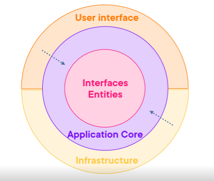
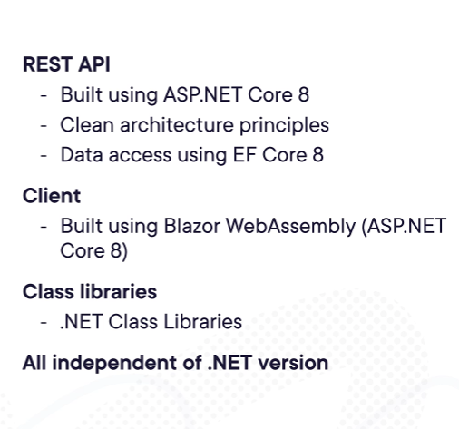
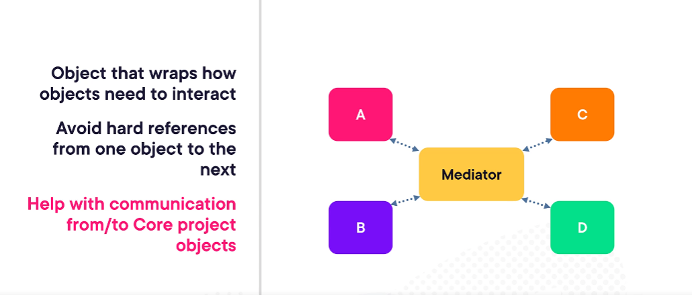

# ASP.NET Core Clean Architecture

- ASP.NET Core 8
- Visual Studio 2022 (any edition)

## Requirements for the New Architecture

- Clean architecture with ASP.NET Core
- Best practices
- Common packages
- Testable and maintainable

Look forward to the New Architecture to build your new projects.

- C#
- ASP.NET COre and EF Core
- REST APIs with ASP.NET Core
- Optionally: Blazor

What You Need

- Visual Studio 2022
- .NET 8 SDK

## Understanding Foundational Architectural Principles

- Foundational design principles
- Different application architectural styles
- Understanding clean architecture

### Important Design Principles

- Dependency inversion
- Separation of concerns
- Single responsibility
- DRY (Don't Repeat Yourself)
- Persistence ignorance

### Dependency Inversion

- Decoupling modules

Dependencies should be pointing to abstractions

### Separation of Concerns

- Split into blocks of functionality
- Each covering a concern
- Componentized, modularized code blocks

More modular code

- Encapsulation within a module

### Single Responsibility

- Each block should just have one single responsibility
- More, new classes are created
- Can be extended to application-level

### DRY (Don't Repeat Yourself)

- Less code repetition
- Easier to make changes

### Persistence Ignorance

- POCO (Plain Old CLR Objects)
- Domain classes shouldn't be impacted how they are saved
- Typically requires base class or attributes

## Different Application Architectural Styles

All-in-one architecture
- Contained typically one (large) Visual Studio project
- Start with quick File > New Project projects
- "Layers" are folders
- Can be difficult to maintain

Layered architecture
- Split according to concern
- Pushes to the idea of SoC (Separate of concerns)
- Promote reuse
- Easier to maintain
- Pluggable (i.e. switch database via database access layer)
- Layers
	- Presentation layer
	- Business logic layer
	- Data access layer
- Disadvantage of Layered Architecture
	- Still "coupling" between layers
	- Behaves as a single application

Clean architecture	
- Based on design principles
- Separate concerns
- Create maintainable and testable application code
- Introduced in 2012 (hexagonal and onion architecture)
- Independent of "external influences"
	- UI
	- Database

- Onion architecture
	- At the core, interfaces and entities are aware of the database implementation
	- Application core, or the business logic, is unaware of any UI implementation
	- Outer layers are pointing inward - working with inner abstractions

Clean architecture is a concentric circle.  From inside out, it consists:
- Interfaces, entities
- Application core
- Infrastructure layer (uses core abstractions)
- UI is the outer layer

Two Important Principles
- Dependency Inversion
- Mediator pattern

 

Core
- Entities
- Interfaces
	- Core
	- Infrastructure
- Services
- Exceptions

No dependency to any Infrastructure-related code or package

Infrastructure
- Data access (EF Core)
- Logging
- API Clients
- Identity
- File Access

UI
- API/MVC/Razor
- Specific ASP.NET Core items
	- Middleware
	- Filters
- Interact with services through MediatR
	- Loose coupling
	- Lightweight controllers
	
Clean Architecture Benefits
- Independent of UI or used frameworks
- No knowledge of used database
- Testable and maintainable

 

## Setting Up the Application Core

- Understanding the business requirements
- Setting up the solution
- Creating the domain (data models)
- Designing the application project
	- Contracts
	- Packages
	- Validation
	- Exceptions

Requirements

- Manage entities
- Entity categories

 

***

 

***

## Creating a Clean Architectured Application

- Blank solution template
- Add Solution folder - src
	- Subfolders
		- API
		- Core (Class libraries)
		- Infrastructure
		- UI
- Add Solution folder - test
- Contracts (Under Core - Class library)
	- Part of the application core
	- Functionality is described in interfaces
	- Implemented in Core and Infrastructure
	- Using Repository pattern
		- Mediates between domain and data-mapping layer
		- Often used in combination with UOW
- Messaging


## Mediator pattern

 

***

## Using MediatR

Simple mediator implementation in .NET
- <a href="https://www.github.com/jbogard/MediatR" target="_blank">https://www.github.com/jbogard/MediatR</a>

Adding MediatR
- Install-Package MediatR

Using
- IRequest
- IRequestHandler

Defining the Request Handler

```C#
public class GetEventsListQueryHandler : IRequestHandler<GetEventsListQuery, List<EventListVm>>
{
	public async Task<List<EventListVm> Handle(GetEventsListQuery request, CancellationToken cancellationToken)
	{
	}
}
```

### Other Features of MediatR

- Logging
- Validation
- Caching

### Mapping Between Objects

- AutoMapper library
- Mapping from one type to another
- A NuGet package
- Startup registration in DI
- Use Profiles to map the mappings (so it happens automappingly:)

A simple example of using the AutoMapper:

```C#
var result = _mapper.Map<List<EventListVm>>(listItems);
```

_mapper is an instance of AutoMapper, and listItems is a simple list that will be mapped to ViewModels, and using the Map method the listItems will be converted to ViewModels type and data copied over.


